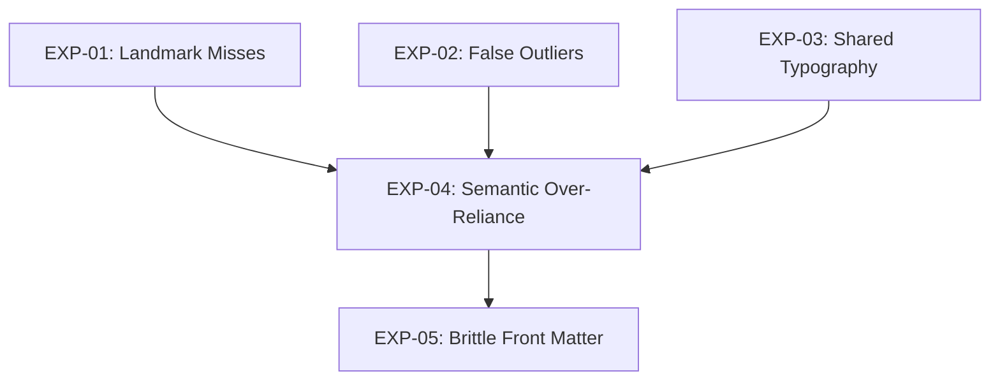

# Experimental Validation Plan
*Compiler Interface and Contract Validation*

## Task 1, 2 & 4 — Experiment Design & Risk Estimation

### EXP-01: Verify Landmark Misses Valid Headers (H1)
*   **Objective**: Prove mathematically that headers smaller than body text fail the Local Maximum `>` check but would pass a Typographic Discontinuity `!=` check.
*   **Files touched**: `extractor/landmarks.py`
*   **Functions touched**: `detect_landmarks`
*   **Maximum code changes**: ~5 lines (Passive logging).
*   **Expected output**: Telemetry logs confirming that Spanner's "1. INTRODUCTION" triggers `curr != prev`, but fails `curr > prev`.
*   **Failure criteria**: The header is proven to pass both, or fails both (disproving the hypothesis).
*   **Rollback criteria**: Remove passive logging.
*   **Risk**: **LOW** (Read-only / Telemetry)

### EXP-02: Verify False OUTLIER Emission Rate (H5)
*   **Objective**: Prove the false-positive rate of the Local Maximum contract by logging every emitted `OUTLIER` that fails Semantic's structural regexes.
*   **Files touched**: `extractor/semantic.py`
*   **Functions touched**: `reconstruct_semantics`
*   **Maximum code changes**: ~4 lines (Passive logging).
*   **Expected output**: Logs demonstrating that inline bold words or stray footnotes generate `OUTLIER` tokens that pollute Semantic.
*   **Failure criteria**: Every emitted `OUTLIER` successfully maps 1:1 to a valid structural node (disproving H5).
*   **Rollback criteria**: Remove passive logging.
*   **Risk**: **LOW** (Read-only / Telemetry)

### EXP-03: Verify Headers Sharing Body Typography (H4)
*   **Objective**: Prove that structural headers can exist without *any* typographic differentiation (e.g., Run-in headers) by checking regexes against the universal body class.
*   **Files touched**: `extractor/semantic.py`
*   **Functions touched**: `reconstruct_semantics`
*   **Maximum code changes**: ~3 lines (Passive logging).
*   **Expected output**: Discovery of valid headers in unseen papers whose `typography_class` perfectly equals `universal_body_class`.
*   **Failure criteria**: Zero occurrences observed across the entire benchmark corpus.
*   **Rollback criteria**: Remove passive logging.
*   **Risk**: **LOW** (Read-only / Telemetry)

### EXP-04: Verify Semantic Over-Reliance on OUTLIER (H2)
*   **Objective**: Prove Semantic can accurately identify structural candidates independently by safely bypassing `is_outlier` for one branch.
*   **Files touched**: `extractor/semantic.py`
*   **Functions touched**: `reconstruct_semantics`
*   **Maximum code changes**: ~2 lines (Conditional logic modification).
*   **Expected output**: Spanner's "1. INTRODUCTION" is correctly captured as a `SECTION_HEADER` despite lacking an `OUTLIER` token.
*   **Failure criteria**: A massive surge of false-positive section headers (e.g., inline bold words destroying the AST), indicating Semantic *requires* Landmark filtering.
*   **Rollback criteria**: Restore the strict `if is_outlier:` condition.
*   **Risk**: **MEDIUM** (Modifies AST construction, potential for false-positive flooding).

### EXP-05: Verify Brittleness of Front Matter Transition (H3)
*   **Objective**: Disprove the necessity of waiting for an `OUTLIER` to exit `FRONT_MATTER_PARSE` by forcing a transition on the first observed standard body paragraph.
*   **Files touched**: `extractor/semantic.py`
*   **Functions touched**: `reconstruct_semantics`
*   **Maximum code changes**: ~3 lines (State machine transition logic).
*   **Expected output**: Documents lacking clear "Abstract" or "Introduction" headers still safely transition to `BODY_PARSE`.
*   **Failure criteria**: Stray body-class paragraphs inside authors/affiliations (rare but possible) trigger premature body transitions, breaking metadata extraction.
*   **Rollback criteria**: Revert front matter transition conditions.
*   **Risk**: **HIGH** (Modifies global state machine transitions; massive regression potential on title pages).

---

## Task 3 — Experiment Dependency Graph

To ensure no experiment depends on an unverified hypothesis, execution must follow this DAG:

---

## Task 5 — Validation Checklist

Every experiment must be verified against the following core corpus:
- [ ] `Spanner`
- [ ] `BERT`
- [ ] `Attention Is All You Need`

Plus five unseen control papers to prevent overfitting:
- [ ] `Dynamo`
- [ ] `Cassandra`
- [ ] `MapReduce`
- [ ] `Google File System`
- [ ] `BigTable`

---

## Task 6 — Execution Order (Safest to Riskiest)

1.  **EXP-01** (Low Risk - Read-only telemetry)
2.  **EXP-02** (Low Risk - Read-only telemetry)
3.  **EXP-03** (Low Risk - Read-only telemetry)
4.  **EXP-04** (Medium Risk - AST modification)
5.  **EXP-05** (High Risk - State Machine modification)
